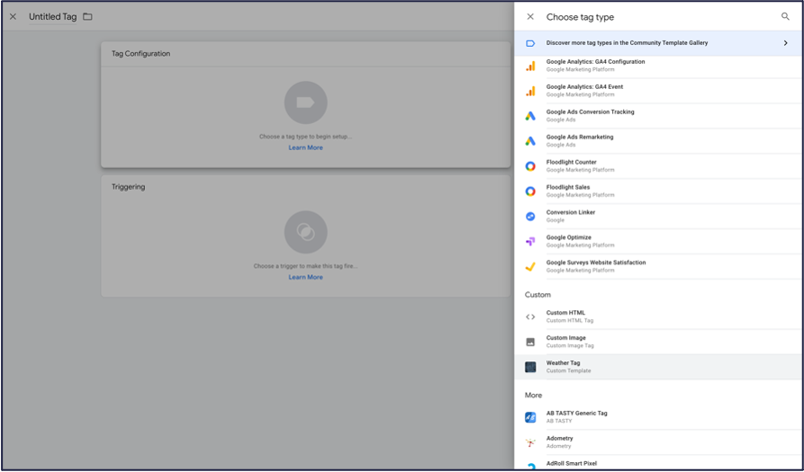
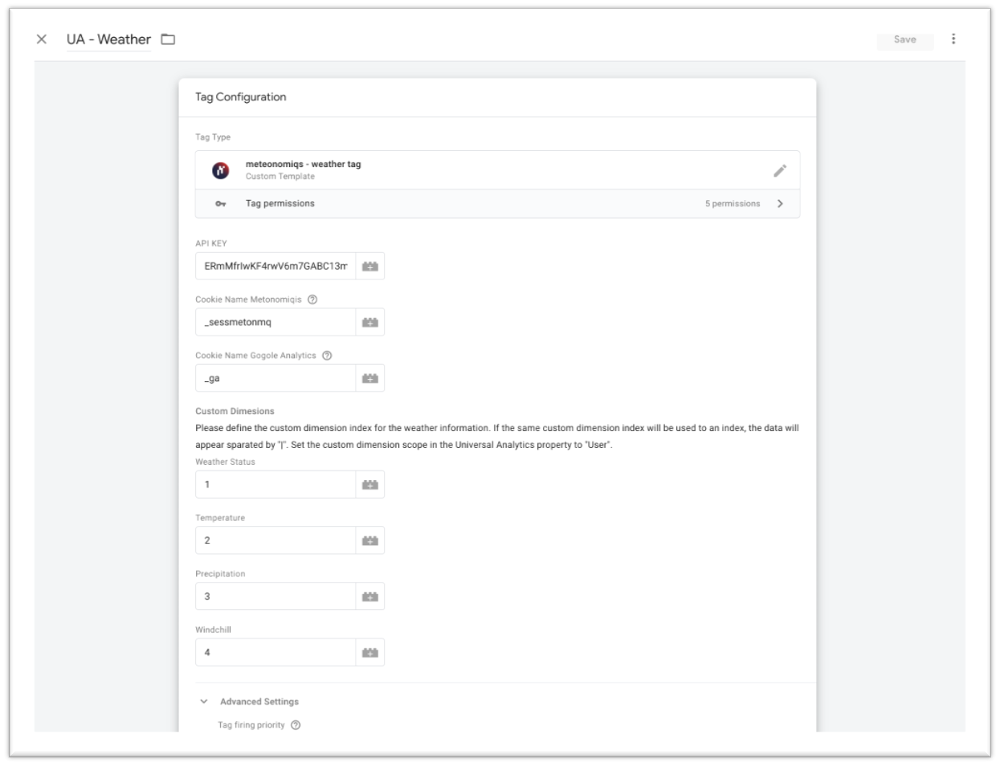
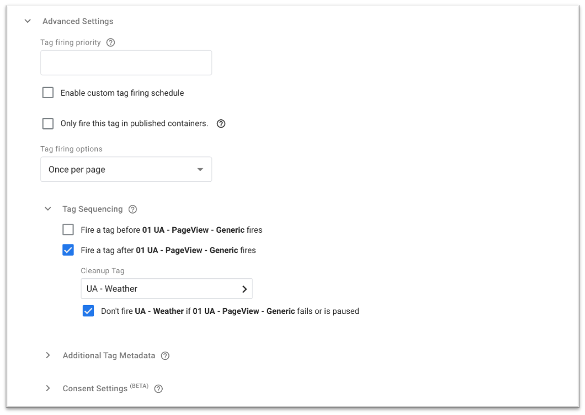
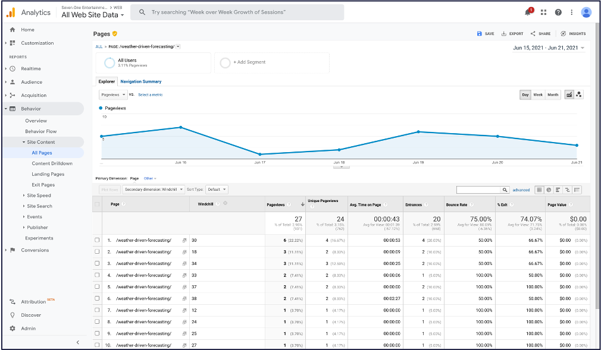
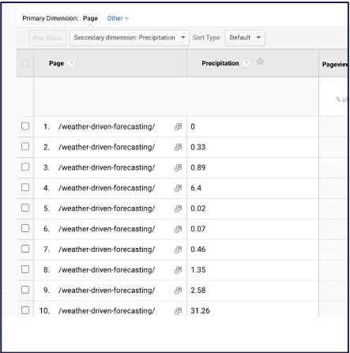

# Google Analytics Weather Tag Template

## Featues 

The *Meteonomiqs Weather Tag* allows you to enrich your Google Analytics data 
with your users weather conditions!

## Setup

##  Step 1: Register at meteonomiqs.com

To use the Meteonomiqs Weather Tag*, a registration is required at https://meteonomiqs.com/weathertag

### Step 2: import tag from gallery

Select the *Meteonomiqs Weather Tag* from the gallery

### Step 3: Configure Tag

Now the tag can be configured

Fill out the following general fields
* `API_KEY`: put here the API key you have received during registration
* `Cookie Name Website`: e.g. `_sessionstate`
* `Cookie Name Google Analytics`: usually `_ga`

Next, the custom dimesions need to be filled.
You can assign multiple weather parameters to the same custom dimenions. In this case the values will be separated by a pipe symbol `|`

Weather parameter that are left blank will not be available in the session data later.

Finally, you have to enable the tag to fire once per page as described here

## Usage

Once the tag is configured and deployed, the custom dimenions of a user session data will contain the configured the weather parameters!

Detailed view:

Go ahead an build you own weather based analysis!