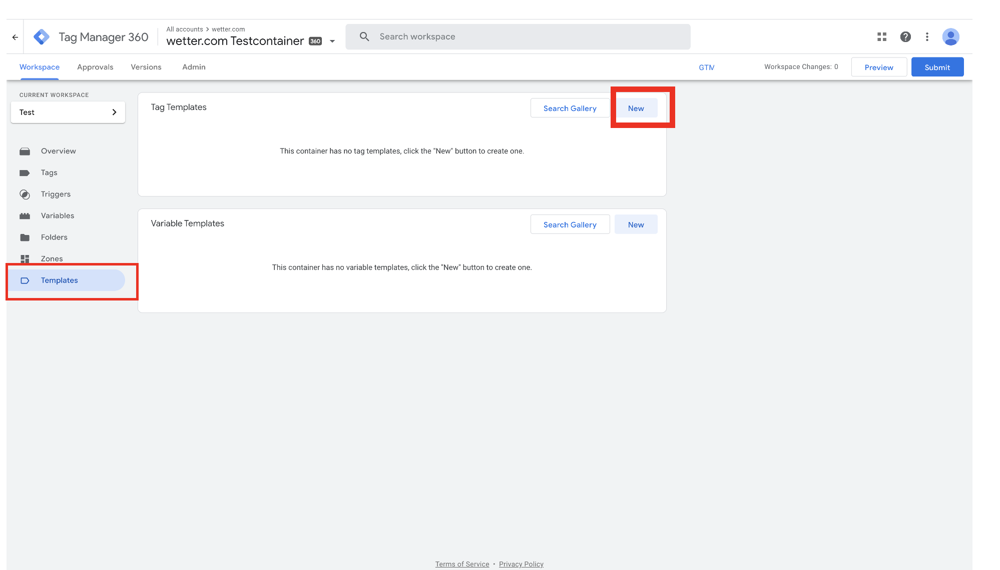
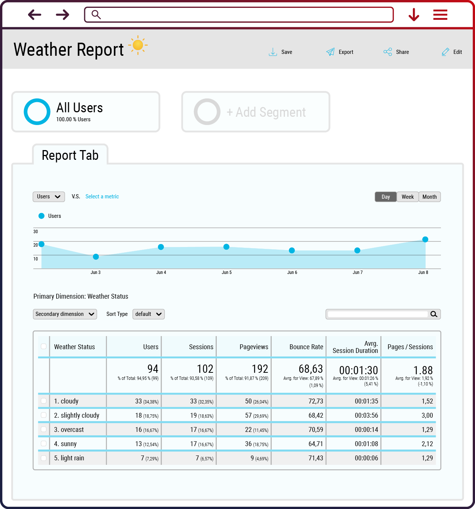

# Google Analytics Weather Tag Template

## Features 

The `meteonomiqs - weather tag` allows you to enrich your Google Analytics user sessions 
with the user's local weather conditions!

## Setup

###  Step 1: Register at meteonomiqs.com

To use the Meteonomiqs Weather Tag*, a registration is required at https://www.meteonomiqs.com/de/wetter-analytics/

### Step 2: import tag from gallery

Open your Google Tag manager account and click on `Templates`

Select the `meteonomiqs - weather tag` from the solution gallery.

***Note: as long as we are not available in the solution gallery, you can download the file 
[template.tpl](https://raw.githubusercontent.com/meteonomiqs/gtm-weather/main/template.tpl)
from this repository manually and upload it into the Google Tag Manager:***

### Step 3: Configure Tag

Now the tag can be configured

Fill out the following general fields
* `API_KEY`: put here the API key you have received during registration
* `Cookie Name Website`: e.g. `_sessmeteonmq`
* `Cookie Name Google Analytics`: usually `_ga`

Next, the custom dimesions need to be filled.
You can assign multiple weather parameters to the same custom dimenions. In this case the values will be separated by a pipe symbol `|`

Weather parameters that are left blank will not be available in the session data later.

**NOTE: make sure only to use indices of custom dimensions that are not used elsewhere!**

Finally, you have to enable the tag to fire once per page as described here

## Usage

Once the tag is configured and deployed, the custom dimenions of a user session data will contain the configured the weather parameters!

You can now analyze how user behaviour is impacted by different weather conditions.

Go ahead an build you own weather based analysis!